<p align="center">
  
</p>

<p align="center">
  <a href="https://www.linkedin.com/in/marco-chavez-jr-334514b4/">
    
  </a>
  <a href="https://github.com/mxrcochxvez?tab=repositories">
    
  </a>
  <a href="https://github.com/mxrcochxvez/hexacombllc">
    
  </a>
</p>

## Hey, I'm Marco

I'm a **software engineer, technical lead, and product builder** based in California's Central Valley. I turn complicated business workflows into fast, accessible products that are easier to use, maintain, and grow.

My background spans ecommerce, internal operations, mobile SaaS, AI tooling, and developer platforms. I enjoy owning a problem end to end: architecture, implementation, documentation, mentoring, accessibility, and the final details that make software feel dependable.

<table>
  <tr>
    <td width="25%" valign="top"><strong>Building</strong><br />AI-first products, local model workflows, and useful automations</td>
    <td width="25%" valign="top"><strong>Leading</strong><br />Through clear architecture, documentation, and mentorship</td>
    <td width="25%" valign="top"><strong>Optimizing</strong><br />Performance, developer experience, and complex user journeys</td>
    <td width="25%" valign="top"><strong>Designing for</strong><br />Accessibility, maintainability, and real business outcomes</td>
  </tr>
</table>

## Featured builds

<table>
  <tr>
    <td width="50%" valign="top">
      <h3><a href="https://github.com/mxrcochxvez/odysseus-babbage">Odysseus Babbage</a></h3>
      <p>A self-hosted AI workspace for chat, agents, research, documents, email, notes, calendar, and local model workflows.</p>
      <p><code>AI Agents</code> <code>MCP</code> <code>Local Models</code> <code>Docker</code></p>
    </td>
    <td width="50%" valign="top">
      <h3><a href="https://github.com/mxrcochxvez/Promptfu">Promptfu LMS</a></h3>
      <p>A full-stack learning platform with authentication, admin workflows, PostgreSQL, testing, and production deployment support.</p>
      <p><code>TanStack Start</code> <code>TypeScript</code> <code>PostgreSQL</code> <code>Netlify</code></p>
    </td>
  </tr>
  <tr>
    <td width="50%" valign="top">
      <h3><a href="https://github.com/mxrcochxvez/react-movie-search">React Movie Search</a></h3>
      <p>A Next.js movie discovery experience built with a domain-first architecture, GraphQL, reusable services, and thoughtful loading states.</p>
      <p><code>Next.js</code> <code>React</code> <code>GraphQL</code> <code>TypeScript</code></p>
    </td>
    <td width="50%" valign="top">
      <h3><a href="https://github.com/mxrcochxvez/hotel-server-graphql">Hotel GraphQL Server</a></h3>
      <p>A typed GraphQL backend playground for hotel data, API design, persistence, and modern Bun-powered server development.</p>
      <p><code>Apollo Server</code> <code>Drizzle ORM</code> <code>SQLite</code> <code>Bun</code></p>
    </td>
  </tr>
</table>

## Engineering toolkit

<p>
  
  
  
  
  
  
  
  
  
  
  
  
  
</p>

```text
Frontend     React · Vue · Next.js · Nuxt · React Native
Backend      Node.js · GraphQL · REST · Apollo · Express
Data         PostgreSQL · SQLite · MySQL · MongoDB · Drizzle
Delivery     Docker · GitHub Actions · Netlify · AWS · CI/CD
Quality      Accessibility · Testing · Performance · Documentation
Leadership   Architecture · Mentorship · Agile Delivery · Code Review
```

## What I bring to a team

- **Product ownership:** I can take ambiguous requirements from discovery through launch and iteration.
- **Technical leadership:** I create clarity through architecture, documentation, healthy code review, and practical standards.
- **Accessible experiences:** I treat WCAG and inclusive interaction patterns as core engineering quality, not cleanup work.
- **Performance thinking:** I look for the bottlenecks that affect customers, teammates, and business operations.
- **Mentorship:** I enjoy helping engineers understand the reasoning behind a solution so the whole team gets stronger.

## A few things I care about

> Make the complicated feel simple. Build for the person using it. Leave the codebase easier to understand than you found it.

When I'm not building software, I'm usually learning something new, spending time with my family, running, or thinking about the next product worth making.

---

<p align="center">
  <strong>Have an interesting product, platform, or automation problem?</strong><br />
  <a href="https://www.linkedin.com/in/marco-chavez-jr-334514b4/">Let's connect on LinkedIn</a>
  &nbsp;•&nbsp;
  <a href="https://github.com/mxrcochxvez?tab=repositories">Browse all repositories</a>
</p>
