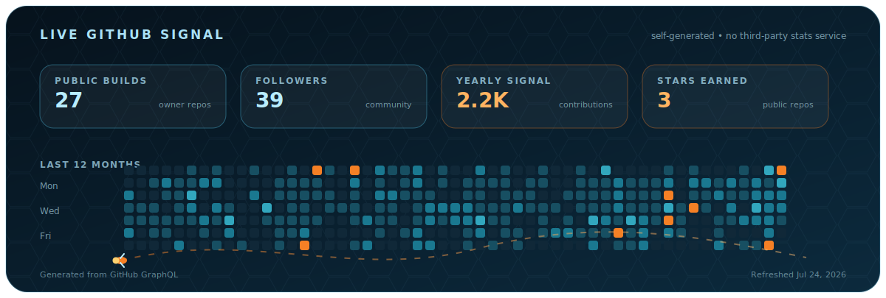
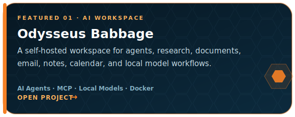
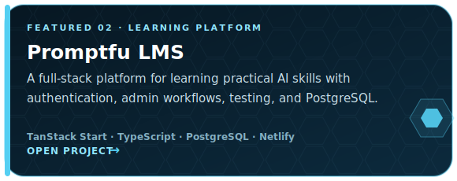
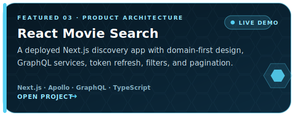
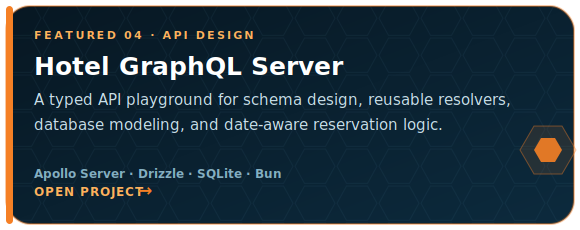
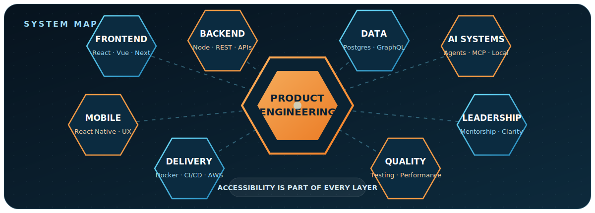

<p align="center">
  
</p>

<p align="center">
  <a href="https://www.linkedin.com/in/marco-chavez-jr-334514b4/"><strong>LinkedIn</strong></a>
  &nbsp;•&nbsp;
  <a href="https://github.com/mxrcochxvez/portfolio"><strong>Portfolio</strong></a>
  &nbsp;•&nbsp;
  <a href="https://github.com/mxrcochxvez/hexacombllc"><strong>Hexacomb LLC</strong></a>
  &nbsp;•&nbsp;
  <a href="https://github.com/mxrcochxvez?tab=repositories"><strong>All repositories</strong></a>
</p>

## Hey, I'm Marco

I'm a **software architect, technical lead, and full-stack product engineer** based in California's Central Valley. I build software that turns complicated business workflows into experiences that feel clear, fast, accessible, and dependable.

My work spans ecommerce, mobile SaaS, internal operations, AI agents, local model tooling, and developer platforms. I am happiest when I can own the whole problem: discovery, architecture, implementation, documentation, mentoring, accessibility, and the last 10% of polish that users actually feel.

<table>
  <tr>
    <td width="33%" valign="top">
      <strong>Currently building</strong><br />
      Self-hosted AI workspaces, agent workflows, and practical automations.
    </td>
    <td width="33%" valign="top">
      <strong>Known for</strong><br />
      Product ownership, technical clarity, accessibility, and mentorship.
    </td>
    <td width="33%" valign="top">
      <strong>Optimizing for</strong><br />
      Useful software, maintainable systems, and measurable business impact.
    </td>
  </tr>
</table>

## Live GitHub signal

<p align="center">
  
</p>

This visualization is generated **inside this repository** from GitHub's GraphQL API and refreshed automatically. The profile keeps working even when a third-party stats-card service disappears.

## Selected builds

<p align="center">
  <a href="https://github.com/mxrcochxvez/odysseus-babbage"></a>
  <a href="https://github.com/mxrcochxvez/Promptfu"></a>
</p>

<p align="center">
  <a href="https://github.com/mxrcochxvez/react-movie-search"></a>
  <a href="https://github.com/mxrcochxvez/hotel-server-graphql"></a>
</p>

<p align="center">
  <a href="https://marco-react-movies-search.netlify.app/">Launch the React Movie Search demo ↗</a>
</p>

## My engineering system

<p align="center">
  
</p>

<details>
  <summary><strong>Open the expanded toolkit</strong></summary>
  <br />

| Layer | Technologies and practices |
|---|---|
| **Frontend** | TypeScript, JavaScript, React, Vue, Next.js, Nuxt, React Native |
| **Backend** | Node.js, GraphQL, REST, Apollo Server, Express, NestJS |
| **Data** | PostgreSQL, SQLite, MySQL, MongoDB, Drizzle ORM |
| **AI systems** | Agent workflows, MCP, local models, retrieval, prompt tooling |
| **Delivery** | Docker, GitHub Actions, Netlify, AWS, CI/CD |
| **Quality** | WCAG accessibility, testing, performance, documentation |
| **Leadership** | Architecture, mentorship, code review, Agile delivery, team agreements |

</details>

## What I bring to a product team

<table>
  <tr>
    <td width="50%" valign="top">
      <h3>01. Ownership without tunnel vision</h3>
      <p>I connect implementation details to user needs, operational workflows, and business outcomes. I can move from an ambiguous request to a shipped, supportable product.</p>
    </td>
    <td width="50%" valign="top">
      <h3>02. Architecture people can follow</h3>
      <p>I use clear boundaries, documentation, examples, and practical standards so a system is understandable beyond the person who first built it.</p>
    </td>
  </tr>
  <tr>
    <td width="50%" valign="top">
      <h3>03. Accessibility as engineering quality</h3>
      <p>I treat WCAG, keyboard interaction, semantic structure, and inclusive UX as part of the definition of done, not a cleanup phase.</p>
    </td>
    <td width="50%" valign="top">
      <h3>04. Leadership that grows the team</h3>
      <p>I enjoy mentoring engineers, improving feedback loops, and explaining the reasoning behind decisions so the whole team becomes more capable.</p>
    </td>
  </tr>
</table>

## The build loop

```text
UNDERSTAND → MODEL → BUILD → VALIDATE → DOCUMENT → IMPROVE
     ↑                                                  ↓
     └────────────── keep the feedback loop short ──────┘
```

> Make the complicated feel simple. Build for the person using it. Leave the codebase easier to understand than you found it.

## Outside the editor

Family time, running, learning new systems, Star Wars, and occasionally turning a small idea into a much larger side project than originally planned.

---

<p align="center">
  <strong>Have an interesting product, platform, or automation problem?</strong><br />
  <a href="https://www.linkedin.com/in/marco-chavez-jr-334514b4/">Start a conversation on LinkedIn</a>
  &nbsp;•&nbsp;
  <a href="https://github.com/mxrcochxvez?tab=repositories">Explore more of my work</a>
</p>
